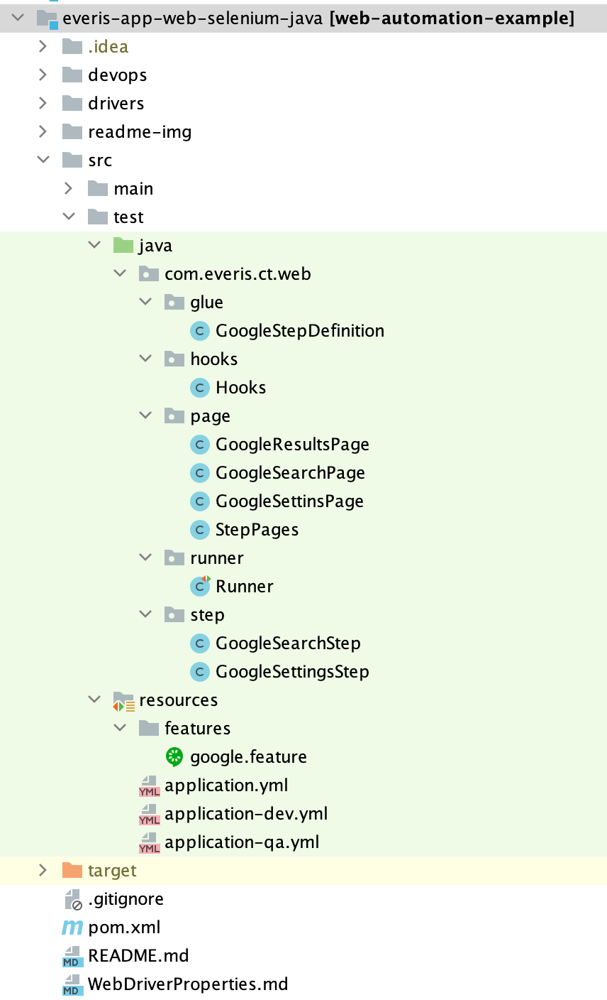

# WEB AUTOMATION

### **Framework de automatización: Continuous Testing**

Esta es una librería de automatización de pruebas End to End creado para crear scripts simples y complejos abstrayendo la complejidad de la herramienta de automatización, en este caso soportado por Selenium 4.

* Integración entre SpringBoot + Selenium + Cucumber
* Librería de automatización: **Selenium 4**

## Integración de SpringBoot + Cucumber

Para crear el contexto de ejecución con SpringBoot y reconocimiento de ejecución de Test con Cucumber. Agregar las
siguientes etiquetas sobre la clase 'glue' o 'StepDefinition'

```
@CucumberContextConfiguration
@SpringBootTest(classes = WebAutomationApplication.class)
public class StepDefinition {}
```

## Arquetipo del Módulo de Pruebas



### ARCHIVO DE PROPIEDADES

SpringBoot gestiona las propiedades de configuración a través del archivo **_'application.properties'_** o **_'application.yml'_**.

## Perfiles y Ambientes

Podemos crear perfiles (ambientes) de ejecución agregando un sufijo al nombre del archivo de propiedades principal y posteriormente
cambiar el ambiente a través de comandos con el nombre del sufijo creado.

```
test
 - resources
    - application.yml
    - application-qa.yml
    - application-dev.yml
    
Comando: 
   $ mvn ... -Dspring.profiles.active=qa
   $ mvn ... -Dspring.profiles.active=dev

```

* Por ejemplo: se puede utilizar una URL para el ambiente de Desarrollo y otra para el ambiente QA

**application.yml** [default]
```
url:
  site: http://default-environmet/uri
```

**application-dev.yml**
```
url:
  site: http://desarrollo-environmet/uri
```

**application-qa.yml**
```
url:
  site: http://calidad-environmet/uri
```

* Posteriormente, se puede llamar a estas propiedades en la clase de tipo Glue o StepDefinition.
* Para luego utilizar el metodo de navegacion **_navigateTo(URL);_**

```
public class StepDefinition {
...
  @Autowired
  private WebDriverManager manager;
  
  @Value("${url.site}")
  private String urlSite;
...
public void initMethod(){
  manager.navigateTo(urlSite); -> navega hacia la url indicada.
}
```

### Ejecución LOCAL

Para crear una nueva instancia del Driver de tipo WebDriver de un Browser especifico, se debe llamar al siguiente metodo:

```
public class StepDefinition {
...
  @Autowired
  private WebDriverManager manager;
...
public void initMethod(){
  manager.setUpDriver(); -> para preparar el driver
  manager.navigateTo(urlGoogle); -> navega hacia la url indicada.
}
```
* Y agregar las propiedades en 'application.properties'

```
application.properties
- webdriver.path=drivers/mac/chromedriver
- webdriver.browser=chrome
```
### Ejecución REMOTA

Para crear una nueva instancia del Driver de tipo RemoteWebDriver de un Browser especifico, se debe llamar al siguiente metodo:

```
public class StepDefinition {
...
  @Autowired
  private WebDriverManager manager;
...
public void initMethod(){
  manager.setUpDriver(); -> para preparar el driver
  manager.navigateTo(urlGoogle); -> establece la url a donde navegar
}
```

* Y agregar las propiedades:

```
application.properties
- webdriver.remote=true -> indica si la ejecución será ejecutada de manera remota hacia un SeleniumHub
- webdriver.hub=http://192.168.0.41:4444/wd/hub -> http://<IP>:<PORT> del Hub configurado
```

### Ejecución en Paralelo

Para poder ejecutar test en paralelo, es necesario tomar en cuenta que Cucumber ya se encarga de repartir las ejecuciones en
hilos independientes siempre y cuando los test se encuentren en distintos features.

```
- funcionalidad-1.feature
- funcionalidad-2.feature

Si ejecutamos esta prueba con el comando '$mvn verify', cada caso de prueba será ejecutando en un hilo independendiente por feature.
Es decir, dos ejecuciones en paralelo con <n> casos de prueba
```

También, hay que tener la consideración de configurar el plugin 'maven-failsafe-plugin' dentro del pom.xml en la
seccion <build>. En donde vamos a indicar el tipo de paralelismo y hasta el número de hilos para la ejecución.

**_Configuración:_**

**-parallel=** indica el tipo de paralelismo. Para la integració con cucumber se usará 'method', en caso se quiera
desactivar el paralelismo deberá comentarse esta etiqueta o agregarle el valor 'none'

**-threadCount=** indica el numero
especifico de hilos a ejecutarse. Importante agregar esta etiqueta siempre y cuando exista la etiqueta 'parallel'

**-useUnlimitedThreads=** También se puede usar esta propiedad si no se quiere especificar un numero concreto de hilos.

```
<plugin>
   <groupId>org.apache.maven.plugins</groupId>
   <artifactId>maven-failsafe-plugin</artifactId>
   <version>2.22.0</version>
      <executions>
         <execution>
             <configuration>
                 <includes>
                   <include>**/*Runner.java</include>
                   <include>**/RunnerTest.java</include>
                 </includes>
                 <parallel>methods</parallel>
                 <!--<useUnlimitedThreads>false</useUnlimitedThreads>-->
                 <threadCount>4</threadCount>
             </configuration>
             <goals>
                <goal>integration-test</goal>
                <goal>verify</goal>
             </goals>
         </execution>
      </executions>
</plugin>
```

## Instanciar del objeto Scenario para la creación de reportes y captura de evidencias

Este objeto es capturado y enviado en la clase de tipo 'glue' o 'stepDefinition'

```
@Autowired
private ManageScenario scenario;
...
@Before
public void beforeScenario(Scenario scenario) {
    this.scenario.setScenario(scenario);
}
```

## Toma de evidencias

Existe más de un tipo de estrategia de captura de evidencias en las clases **Step**:

* _**@ScreenShotBefore**_ = [Scope: **Method**] - Captura la evidencia antes de la ejecución del método.

```
public class GoogleSearchStep {

    @ScreenShotBefore
    public void searchData(String data) {
        view.searchPage().writeSearch(data);
    }
```

* _**@ScreenShotAfter**_ = [Scope: **Method**] Captura la evidencia despues de la ejecución del método.

```
public class GoogleSearchStep {

    @ScreenShotAfter
    public void searchData(String data) {
        view.searchPage().writeSearch(data);
    }
```

* _**@ScreenShot**_ = [Scope: **Class**] Captura la evidencia antes y después a todos los métodos ejecutados.

```
@ScreenShot
public class GoogleSearchStep {

    public void searchData(String data) {
        view.searchPage().writeSearch(data);
    }
```

* _**scenario.shotWhenFail();**_ = [Scope: **After Scenerio**] Captura la evidencia cuanto ocurre un error. Modo de uso:

```
public class GoogleStepDefinition {
...
  @Autowired
    private ManageScenario scenario;
...
   @After
    public void afterScenario() {
        scenario.shotWhenFail();
    }
```

## Estrategia de Log para analizar el tiempo de ejecución de los metodos en las clases **Step** (opcional):

* _**@LogTime**_ = [Scope: **Class**] - Calcula el tiempo de ejecución en los metodos de ejecución.

```
@LogTime
public class GoogleSearchStep {
...
}
```

## Detener el driver

Para detener el Driver debe llamarse al metodo en el metodo @Before de cada Scenario:

```
public class GoogleStepDefinition {
...
  @Autowired
  private WebDriverManager manager;
...
  @After
  public void afterScenario() {
     manager.quitDriver();
  }
```

## Accediendo a los metodos de ejecución de Selenium, JavaScript y localización de elementos

En la ultima capa del arquetipo del Modulo de pruebas (PageObject).
Para acceder a los metodos de tipo 'wrapper' de Web se extiende de la clase WebBase.

```
public class GoogleResultsPage extends WebBase {

  @FindBy(xpath = "//div[@id='result-stats']")
  private WebElement searchButton;
...
  public void search() {
      click(buscarButton);
   }
```

Existen 3 maneras de llegar a estos metodos.

- **_default_** = Extendiendo de la clase **'WebBase'** tenemos acceso a los metodos de tipo 'wrapper' que envuelven un comando propio de Selenium.
- **_find()_** = Accede a metodos que permiten localizar elementos sin llamar al metodo **'findElement()'**.
- **_js()_** = Accede a los metodos que ejecutan comandos de js a través de la clase **'JavascriptExecutor'**.

## Configuración de las Opciones de Cucumber

* **@CucumberOptions()** = Soportará las opciones de cucumber
* **plugin = {"json:target/build/cucumber.json"}** = Json que guardar la trazabilidad de ejecución de Cucumber, Posteriormente se usara para la integración con Jira.
* **stepNotifications = true** = Muestra el paso a paso de la ejecución (Opcion cosmetica).
* **publish = true** = Publica un reporte 'público' en el servidor de Cucumber (Este reporte no requiere autorización).
* **features = {"src/test/resources/features"}** = Indica donde están alojados los features.
* **glue = {"com.everis.ct.web.glue"}** = Indica donde está ubicada la definición de los pasos
* **tags = "@REG_GOOGLE"** = Tag indicador de una prueba o un conjunto de pruebas

```
@CucumberOptions(plugin = {"json:target/build/cucumber.json"}, 
        stepNotifications = true,
        publish = true, 
        features = {"src/test/resources/features"}, 
        glue = {"com.everis.ct.web.glue"},
        tags = "@REG_GOOGLE"
)
public class Runner {}
```

## Integración DataSources JDC
La librería tiene como dependencia "spring-boot-starter-jdbc" lo que permite conectarnos a una BD con solo declarar las
propiedades que necesita springBoot para realizar la conexión a BD.

```
spring:
  dataSource:
    driver-class-name: org.postgresql.Driver
    url: jdbc:postgresql://localhost:54322/xxxxx
    username: xxxxx
    password: xxxx
```

También, la librería internamente ya cuenta con el driver de conexión a la BD "postgresql" en runTime, por lo que ya no es
necesario agregar en el pom.xml del proyecto. En caso querramos conectarnos a otro Driver de BD, esta dependencia debería agregarse
en el archivo pom.xml del proyecto.

Para acceder al utilitario con metodos de ayuda para manejar la BD donde nos vamos a conectar, debemos inyectar la siguiente dependencia
en nuestro objecto:

```
 @Autowired
 private JDBCOperations jdbcOperations;
 
 ...
 
 public void method(){
  jdbcOperations.countRow("public.demoTable");
 }
```

**_Métodos utilitarios:_**
Revisar objecto demo: **com.everis.ct.api.jdbcDemo/JdbcTest.java**

## Generación de reporte HTML Cucumber

Para generar un reporte HTML local de los resultados con cucumber, es necesario agregar el siguiente plugin en la sección </build> del archivo pom.xml

```
            <plugin>
                <groupId>net.masterthought</groupId>
                <artifactId>maven-cucumber-reporting</artifactId>
                <version>5.6.2</version>
                <executions>
                    <execution>
                        <id>cucumber-reports</id>
                        <phase>verify</phase>
                        <goals>
                            <goal>generate</goal>
                        </goals>
                        <configuration>
                            <projectName>cucumber-jvm-example</projectName>
                            <skip>false</skip>
                            <outputDirectory>${project.build.directory}/site</outputDirectory>
                            <!-- optional, defaults to outputDirectory if not specified -->
                            <inputDirectory>${project.build.directory}/build</inputDirectory>
                            <jsonFiles>
                                <param>**/*.json</param>
                            </jsonFiles>
                        </configuration>
                    </execution>
                </executions>
            </plugin>
```

Donde, las configuraciones:

* **outputDirectory=** Indica el directorio en donde se generará el reporte HTML de cucumber. En el ejemplo, la ruta especfica el directorio **_Target_** y la carpeta **_/site_**
* **cucumberOutput=** Indica la ruta del archivo output generado posterior a la ejecución. La ruta de este archivo debe coincidir con el especificado en las **_opciones de cucumber_** en la clase Runner.

Por último, realizar la ejecución de un goal  por comandos. Se recomienda utilizar el goal clean para limpiar ejecuciones anteriores.

```
$ mvn clean verify
```

## Integración con Jira y JiraXray

Para integrar las pruebas con el plugin Xray de Jira, utilizar la siguiente configuración:

```
@RunWith(Cucumber.class)
@CucumberOptions(plugin = {"json:target/build/cucumber.json"},
        stepNotifications = true,
        publish = true,
        features = {"src/test/resources/features"},
        glue = {"com.everis.ct.web.glue"},
        tags = "@REG_GOOGLE"
)
public class Runner {
...
    @AfterClass
    public static void afterExecution() {
        Logger.getLogger(Runner.class.getName()).log(Level.INFO, "AFTER EXECUTION --->");
        JiraXray.importResults();
    }   
```

Configuración de propiedades para Jira

**-jxray.integration**= Activa o desactiva la integración con Jira. Por defecto el valor es 'false'

**-jxray.host**= Host de Jira

**-jxray.client.id**= Credencial generada en la plataforma de Jira. Client Id

**-jxray.client.secret**= Credencial generada en la plataforma de Jira. Secret Id

```
jxray:
  integration: off
  host: "https://xray.cloud.xpand-it.com"
  client:
    id: XXXXX
    secret: XXXXX
```

## Extent Report - PDF y HTML

El FrameWork genera también otro tipo de reportería soportado por la librería **_'extentreports-cucumber6-adapter'_**

Para poder acceder a esta otra alternativa, completar los siguientes pasos.

1. En las opciones de cucumber, en la opción **'plugin'**, agregar el adaptador de la libreria extent _**"com.aventstack.extentreports.cucumber.adapter.ExtentCucumberAdapter:"**_
```
@RunWith(Cucumber.class)
@CucumberOptions(plugin = { "pretty", "json:target/build/cucumber.json",
        "com.aventstack.extentreports.cucumber.adapter.ExtentCucumberAdapter:"
        },
        stepNotifications = true,
        monochrome = true,
        publish = true,
        features = {"src/test/resources/features"},
        glue = {"com.pichincha.sw.web.glue"},
        tags = "@TAG"
)
```

2. Crear el archivo de propiedades _**"extent.properties"**_ en el directorio de recursos: _**src/test/resources**_ y copiar el siguiente contenido:

* Modificar los datos entre "< >"

```
extent.reporter.spark.start=true
extent.reporter.spark.config=src/test/resources/extent-config.xml
extent.reporter.spark.out=test-output/SparkReport/
screenshot.dir=test-output/
screenshot.rel.path=../
extent.reporter.pdf.start=true
extent.reporter.pdf.out=test-output/PdfReport/<NOMBRE_DEL_REPORTE>.pdf
extent.reporter.spark.base64imagesrc=true
extent.reporter.spark.vieworder=dashboard,test,category,exception,author,device,log
systeminfo.os=<CONTEXTO_SISTEMA_OPERATIVO>
systeminfo.user=<ACTOR_EJECUTOR>
systeminfo.build=<VERSION_BUILD>
systeminfo.AppName=<NOMBRE_DEL_APP>
```

3. Crear el archivo xml _**"extent-config.xml"**_ en el directorio de recursos: _**src/test/resources**_ y copiar el siguiente contenido:

```
<?xml version="1.0" encoding="UTF-8"?>
<extentreports>
    <configuration>
        <!-- report theme -->

        <!-- standard, dark -->

        <theme>dark</theme>
        <!-- document encoding -->

        <!-- defaults to UTF-8 -->

        <encoding>UTF-8</encoding>
        <!-- protocol for script and stylesheets -->

        <!-- defaults to https -->

        <protocol>http</protocol>
        <!-- title of the document -->
        <documentTitle>Extent</documentTitle>
        <!-- report name - displayed at top-nav -->

        <reportName>Grasshopper Report</reportName>
        <!-- location of charts in the test view -->

        <!-- top, bottom -->

        <testViewChartLocation>bottom</testViewChartLocation>
        <!-- custom javascript -->

        <scripts>

            <![CDATA[
$(document).ready(function() {
});
]]>
        </scripts>
        <!-- custom styles -->
        <styles>
            <![CDATA[
]]>
        </styles>
    </configuration>
</extentreports>
```

4. Ejecutar la prueba desde la clase Runner o por comandos. Al finalizar se creara una carpeta en el root del proyecto con los reportes en formato PDF y HTML.

##Recomendaciones

** Se recomienda utilizar una clase @Component que centralise las creación de los PageObject
y posteriormente inyectar las dependencias en las clases **Step**

```
@Component
public class StepPage {

    protected GoogleSearchPage search(){
        return new GoogleSearchPage();
    };

    protected GoogleResultsPage results(){
        return new GoogleResultsPage();
    }

    protected GoogleSettinsPage settins(){
        return new GoogleSettinsPage();
    }
}

---
public class GoogleSearchStep {

 @Autowired
 private StepPage page;
 
...
 public void searchData(String data) {
        //metodo de accion en el PageObject
        page.search().writeSearch(data); 
 }
```

** Se recomienda utilizar la siguiente estretegia de capturas de evidencias:

- _**@ScreenShotBefore**_ = [Scope: **Method**] - Captura la evidencia antes de la ejecución del método.
- _**@ScreenShotAfter**_ = [Scope: **Method**] Captura la evidencia despues de la ejecución del método.
- _**scenario.shotWhenFail();**_ = [Scope: **After Scenerio**] Captura la evidencia cuanto ocurre un error.